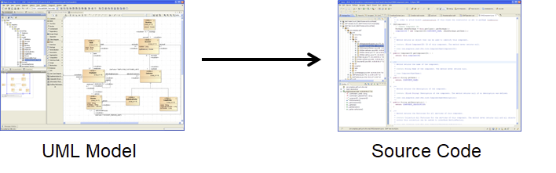
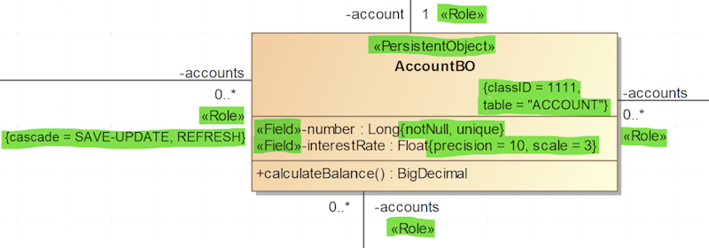

# Model Driven Software Development

This part of the modeling guide will shortly describe the basic ideas 
that are behind model driven software development and are just a very 
basic introduction.

 

## The Idea of Model Driven Software Development

Basis for all model driven software development process is the idea, that before actually implementing a system it should be described before on a higher level of abstraction using a formal approach like UML. This covers the static structure of a system like components, services and domain objects as well as the dynamic aspects like use cases and activities.

As soon as your model is ready you can start generating code and get rid of writing boiler blade code. All you need therefore is JEAF Generator :-)

 

## Preconditions for Model Driven Software Development

If you want to model a system / application using UML some preconditions need to be fulfilled. Those preconditions are not only required when using model driven approaches but also when working more traditional. However, in case of model driven software development they are mandatory. Code generators simply won’t be able to do anything meaningful if the preconditions are not met.

 

- **Architecture Model**  
  The architecture model is independent of a concrete project or application. It defines a generic blueprint that can be used to build applications. Usually the architectural framework is very high level and only defines the blocks that are used to build applications like components, services etc.  
  
  For further details please refer to [JEAF Architecture Model](https://anaptecs.atlassian.net/wiki/spaces/JEAF/pages/515276970 "https://anaptecs.atlassian.net/wiki/spaces/JEAF/pages/515276970")  
  
   

- **Extensions to UML standard meta model (JEAF Meta Model)**  
  The [JEAF Architecture Model](https://anaptecs.atlassian.net/wiki/spaces/JEAF/pages/515276970 "/wiki/spaces/JEAF/pages/515276970") defines the structure of a system from a technical perspective and defines which parts of the system need to be defined inside the UML model at a minimum.  
  
   
  Most information can be directly expressed using the UML standard model. All the things that are not part of the standard model can be added as an extension to the standard meta model. UML therefore defines a mechanism called “stereotypes” which can be used to extend the standard meta model. These extensions will be called “JEAF Meta Model”.  
   
  For further details please refer to [JEAF Meta Model](https://anaptecs.atlassian.net/wiki/spaces/JEAF/pages/514982339 "https://anaptecs.atlassian.net/wiki/spaces/JEAF/pages/514982339")  
   

- **Best Practices  / Coding Guidelines**
  Best Practices only have an indirect influence on the modeling. However they are required as the generator will make use of them when generating code.

 

## How to extend the UML Meta Model

As mentioned above the standard UML meta model needs to be extended in order to be able to express all we need for enterprise class code generation based on a UML model.

 

At least since version 2.0 UML offers a wide variety of possibilities to describe different aspects of an application by using different types of model elements and diagrams. Usually they are very convenient and sufficient when it comes to standard software development. However if we are talking about model driven software development then the UML standard model is not meaningful enough. In this case it is mandatory to add additional technical information to the model that are required for code generation.

 

The UML standard offers an outstanding support for these requirements by so called stereotypes. Stereotypes are extensions to the UML model and can be used for a wide variety of purposes. Besides already predefined stereotypes it’s also possible to define your own. Using stereotypes it’s possible to add additional information to every element of an UML model. Stereotypes also allow to add additional attributes to your model elements no matter if it is a class, an attribute, an association etc. These additional attributes are called “tagged values”. Of course tagged values also have a type like any other attribute.

 

The picture below provides a first impression how powerful the concept of stereotypes and tagged values is. Stereotypes are surrounded by `«` and `»` like `«PersistentObject»`. Tagged values of a stereotype are shown close to the element they were applied on using `{` and `}` like `{classID= 1111, table=”ACCOUNT”}`.

 

The meaning of each of the stereotypes and its tagged values are be described on page [JEAF Meta Model](https://anaptecs.atlassian.net/wiki/spaces/JEAF/pages/514982339 "https://anaptecs.atlassian.net/wiki/spaces/JEAF/pages/514982339").
